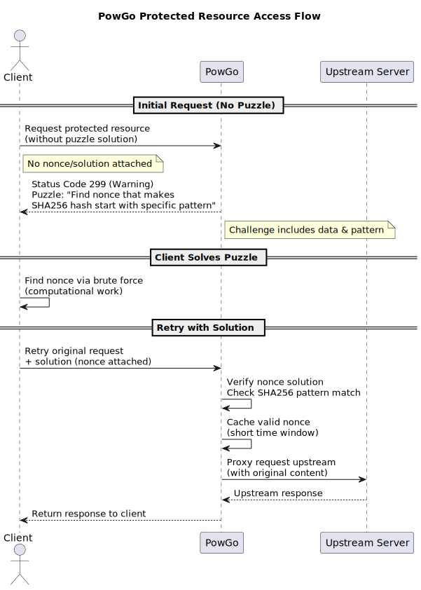

# PowGo

A lean reverse proxy that makes bots work for their requests.

PowGo sits in front of your upstream services and requires clients to solve a small proof-of-work puzzle before their request goes through. No CAPTCHA and no login wall, just a lightweight cryptographic handshake that makes bulk spam and naive DoS attacks economically annoying for the attacker.

## What problem does this solve?

Public endpoints get spammed. Anything that doesn't require authentication is a target for bots and script kiddies. Rate limiting by IP and/or account identifiers helps, but IPs and emails are cheap. PowGo adds a **natural rate limit** driven by CPU cost: every request burns a tiny bit of compute on the client side. For a human clicking a button, it's imperceptible. For someone trying to blast 10,000 requests per second, it becomes expensive fast.

## How it works

PowGo implements a modified version of [**Hashcash**](https://en.wikipedia.org/wiki/Hashcash), the same proof-of-work concept that powers email spam filters and some blockchains.



Here's the flow:

1. Client requests a protected resource without a PowGo puzzle solution.
2. PowGo responds with status code `299` (a warning) and a puzzle: "find a nonce that makes the SHA256 hash of this data start with a specific pattern."
3. Client finds the nonce.
4. Client retries the original request with the solution attached.
5. PowGo verifies the solution, caches the valid nonce for a short window, and proxies the request upstream.

Clients that repeatedly submit bad solutions get temporarily blocked.

### The tweak to Hashcash

Classic Hashcash requires the hash to start with *N* leading zero bits. PowGo uses **hex-encoded SHA256** and checks the first *N* characters against a **configurable set of allowed hex digits**. This gives you two dials to tune difficulty:

- `difficulty`: how many leading characters must match
- `allowedHexDigits`: which characters are considered valid (e.g., only `0`, `1`, `2`, `d`, `e`, `f`)

A smaller allowed set makes the puzzle harder without increasing the character count, giving you finer control over the work required.

## The client-side piece

The repo includes [a JavaScript wrapper](./js/powgo.js) around `fetch()` that handles the puzzle negotiation automatically. In your frontend code, it looks like this:

```javascript
import { fetchhWithPOW } from './powgo.js'

const response = await fetchhWithPOW('/api/submit', {
  // example request
  method: 'POST',
  body: JSON.stringify({ message: 'hello' })
})
```

The wrapper intercepts `299` responses, solves the puzzle silently, and retries the request.

## Configuration

Here's an example `config.json` with explanations inline:

```json
{
  "difficulty": 11,
  "allowedHexDigits": "012def",
  "redisHost": "localhost",
  "redisPort": "6379",
  "port": "8080",
  "allowedOrigins": [
    "https://domain1.com",
    "https://sub.domain1.com"
  ],
  "upstreams": {
    "domain1.com": "https://domain1-api.com",
    "*": "https://fallback-api.com"
  }
}
```

| Field | What it does |
|-------|--------------|
| `difficulty` | Number of leading hex characters that must match the allowed set. Higher = harder puzzle. |
| `allowedHexDigits` | Set of hex characters (0-9, a-f) considered valid for the leading prefix. Use fewer characters to increase difficulty without bumping `difficulty`. |
| `redisHost` / `redisPort` | Redis instance used to store sessions and temporary blocks. Redis keeps the proxy stateless so you can run multiple instances. |
| `port` | Port PowGo listens on. |
| `allowedOrigins` | CORS origins that get the `Access-Control-Allow-Origin` header in puzzle responses. Your frontend domain(s) go here. |
| `upstreams` | Hostname-based routing. Requests with `Host: domain1.com` go to `https://domain1-api.com`. Everything else (`*`) goes to `https://fallback-api.com`. |

## Running PowGo

1. Make sure Redis is running (`redis-server`).
2. Craft your `config.json`. Let's assume it is located in `/path/to/config.json`
3. Run powgo in one of these ways:
  a. Using Docker: place your config file in /app/config.json
  ```shell
  docker run -v /path/to/config.json:/app/config.json codomatech/powgo
  ```
  b. On baremetal:
    i. Clone and compile this repo using:
    ```shell
    go mod tidy
    go build .
    ```
    ii. Run the resulting binary
    ```shell
    ./powgo -config /path/to/config.json
    ```

## When to use this

- Any endpoint where you want to add friction for bots without annoying humans

## When *not* to use this

- Latency-sensitive applications where even a few hundred milliseconds of puzzle-solving is unacceptable
- If you already have robust rate limiting and WAF in place

## License

AGPLv3

---
`PowGo` is a work of :heart: by [Codoma.tech](https://www.codoma.tech/).
